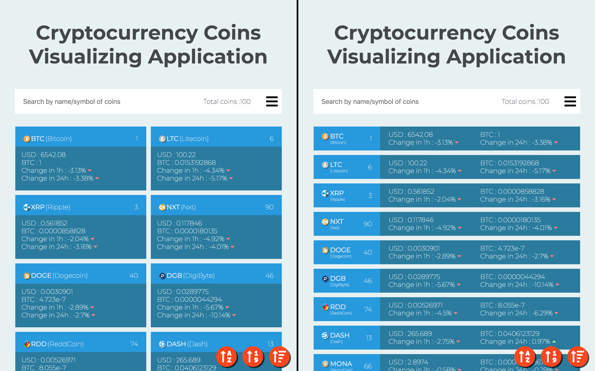

# Cryptocurrency Coins Visualizing Application

Cryptocurrency Coins Visualizing Application using CoinMarketCap API v2 with <a href="https://trungh13.github.io/integrify-assignment9-cryptocurrency/">live demo</a> and the screenshot of application below:

## Version
v0.2 ReactJS <a href="https://github.com/trungh13/integrify-assignment9-cryptocurrency/tree/master-react">Source code in master-react branch</a>.
* Redo the application with ReactJS/ CSS Modules 
* Change sorting method, can sort coins when searching.
* Deploy it to <a href="https://github.com/trungh13/integrify-assignment9-cryptocurrency/tree/gh-pages">gh-pages branch </a>using <a href="https://github.com/gitname/react-gh-pages">react-gh-pages</a>

v0.1 VanillaJS <a href="https://github.com/trungh13/integrify-assignment9-cryptocurrency/tree/master">Source code in master branch</a>.
  
  * Fetch data from <a href="https://api.coinmarketcap.com/v2">CoinMarketCap API v2</a>
  * Initially, fetch 100 first coins, then fetch 100 more coins when scroll to the bottom of the page.
  * Search by Name/Symbol of the coin.
  * Sort coins by Name/Price/Rank.
  * Two display methods:
    *  Grid for viewing more coins 
    *  Table for more systematic when sorting.
  * Responsive design.


## Getting Started

These instructions will get you a copy of the project up and running on your local machine for development and testing purposes. See deployment for notes on how to deploy the project on a live system.

### Prerequisites

**You’ll need to have Node >= 6 on your local development machine** (but it’s not required on the server). You can use [nvm](https://github.com/creationix/nvm#installation) (macOS/Linux) or [nvm-windows](https://github.com/coreybutler/nvm-windows#node-version-manager-nvm-for-windows) to easily switch Node versions between different projects.

### Installing

A step by step series of examples that tell you how to get a development env running

```
git clone https://github.com/trungh13/integrify-assignment9-cryptocurrency.git

cd integrify-assignment9-cryptocurrency

npm install
```
---
©2018 Trung Hoang. Visit me on <a href="https://github.com/trungh13/">:octocat:</a> 